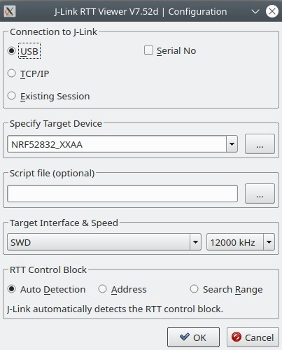

## Set-up your environment on Windows 10
### Install git
https://git-scm.com/download/win
<br/><br/>

### Install the SDK 1.6.0
Download and install the latest version of the __nRF connect__ with the link below : \
https://www.nordicsemi.com/Products/Development-tools/nRF-Connect-for-desktop/Download#infotabs \
Install with default selections in order to install required tools as `J-Link`.
Open `nRF connect` application and install `Bluetooth low energy` and `Toolchain manager` apps. \
Open the `toolchain manager` and you can now install the `nRF Connect SDK v1.6.0`.


<p align="center">
    
</p>

A window will open to propose you the firsts steps to build a project, click `close`. \
Once the installation of the SDK is complete click the `open ide` button. \
Configure the window depending on your board :

<p align="center">
    
</p>

_( Issue : "The window does not open" -> you can find it on SEGGER with `File` , `Open nRF Connect SDK Project` )_ \
__SEGGER Embeded Studio__ will open on the example project, now click `View` , `Toolbars` , `Show all toolbars` to open all toolbars. \

### Build and flash the application

Now try building and debuging your application on the card with the following buttons (don't forget to continue running after the first breakpoint).

<p align="center">
    
</p>

You can also only flash with `Target` , `Download zephyr/zephyr.elf`

_( Issue : "Flashing does not work" -> try `Target` , `Connect J-Link` )_

_( Issue : "Connecting gives `Cannot connect: active project is not an executable`" -> select `zephyr` as your current project as below ) :_

<p align="center">
    
</p>


In order to activate the RTT logging modify `prj.conf` (located in the `peripheral_lbs` folder) with a file editor and add the following lines :

```
# choose RTT console
CONFIG_UART_CONSOLE=n
CONFIG_USE_SEGGER_RTT=y
CONFIG_RTT_CONSOLE=y

# General config
CONFIG_LOG=y
CONFIG_LOG_DEFAULT_LEVEL=4
```

Now build and debug and you will see the `printk` output in the SEGGER Debug window. You can also use `JLinkRTTViewer.exe` to see the prints coming from the card.
<br/><br/>

### Use the command line tools
Try using the command line tools. To do so go on the toolchain manager 

<br/><hr><br/>

## Set-up your environment on Linux
### File tree
In the next part you will dowload two files `ncs` containing the SDK and `ses` containing the Segger IDE. \
I recommand to organize your folders as follow : 

wrlds \
├── ncs \
├── nRF_tests (this repository) \
└── ses

### Downloads
Follow the steps given here. 
https://developer.nordicsemi.com/nRF_Connect_SDK/doc/1.6.0/nrf/gs_installing.html

_( Issue : "How to install the Command Line Tools" -> download https://www.nordicsemi.com/Software-and-Tools/Development-Tools/nRF-Command-Line-Tools \
and unzip it and install the `.deb` packages)_ 

Recommanded : When dealing with the environment variable in the tutorial directly add them to you .bashrc if you use bash (`gedit ~/.bashrc` and add the following lines) :

```
# WRLDS
export PATH=${HOME}/gn:"$PATH"
export ZEPHYR_BASE=${HOME}/Documents/wrlds/ncs/zephyr
export ZEPHYR_TOOLCHAIN_VARIANT=gnuarmemb
export GNUARMEMB_TOOLCHAIN_PATH="~/gnuarmemb"
```

<br/><hr><br/>

## Create a project

### Get the example code
In order to start with an example squeleton I copied the `peripheral_lbs` folder from `ncs/nrf/samples/bluetooth/peripheral_lbs` to the `nRF_tests/app` folder. Take care to remove the `build` folder. The important files and folders are `src` (contains your code), `CMakeLists.txt` (contains the instructions to create the `build` folder), `Kconfig` (adds personal configuration macros), `prj.conf` (enables configurations macro).
<br/><br/>

### Start modifying
After trying to understand `main.c` I removed every import and functions used for the bluetooth to keep only function calls for leds and buttons. \
Then I modified the `prj.conf` file in order to configurations needed for bluetooth and add the one needed for RTT communications (`printk`).
<br/><br/>

### Try running
Run your first own application with the following commands :
```
wrlds/app$ west build -b nrf52dk_nrf52832 && west flash
```

The build folder is created and the programm will be flashed on the board.

_( Issue : "ninja: error: loading 'build.ninja': No such file or directory" or infinite ninja build -> delete the `build` folder and try again )_

Now open `JLinkRTTViewer` (`.exe` on windows and command line on Linux) and connect it to the board.

<p align="center">
    
</p>

_( Issue : "I don't receive anything" -> When you flash the card you loose the connection. Try `disconnect` and `connect` in the top bar. Try clicking on the reboot button of the board and you should at least see the OS booting message. )_
<br/><br/>

### Add a new source file
For bigger projects you need several source files. Just create them normally and add their sources in the `CMakeLists.txt` file. Look to the `app` folder for example. 

_( Issue : "multiple definition of ..." -> do not forget that global variables has to be defined as extern in the header file )_

<br/><hr><br/>

## Testing a project

### Get the example code
In order to start with an example squeleton I copied the `unity` folder from `ncs/nrf/tests/unity` to the `nRF_tests/tests` folder. Take care to remove the `build` folder. You can look this folder for understanding how CMock works : \
https://embetronicx.com/tutorials/unit_testing/unit-testing-in-c-mock-using-cmock-in-embedded/
<br/><br/>

### Explanations and run
We will use Unity and CMocks to test our code. This code will be run on your computer and not anymore on the card. This means that a lot of functions calls will be a problem, for instance when your code tries to light a led or read a button the computer will not be able to execute the code since it doesn't have the hardware.

This is why we use CMock. It will create fake header files ignoring the functions that you cannot run on your computer. For instance if in order to remove all the calls to leds and buttons we add in `nRF_tests/tests/test_fsm_1` the following line :
```
cmock_handle(../../../ncs/nrf/include/dk_buttons_and_leds.h)
```
This will generate a fake header in `build/mocks`. In `test_fsm_1/test.c` you can now see that we can execute functions containing hardware calls without problems.

To run go in the folder `test_fsm_1` and run :
```
west build -b native_posix -t run
```
If there is an error, read the description. If it is a test assertion error it means that your test built and ran sucessfully but the application didn't pass the test.
<br/><br/>

### Mock functions
In `test_fsm_1` we just ignore the hardware call, but we can also remplace them by an other function. Read the tutorial given before for more informations. But for instance in `test_fsm_2` we replace our call to led by our own callback function.
<br/><br/>